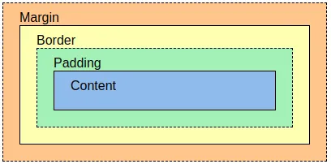
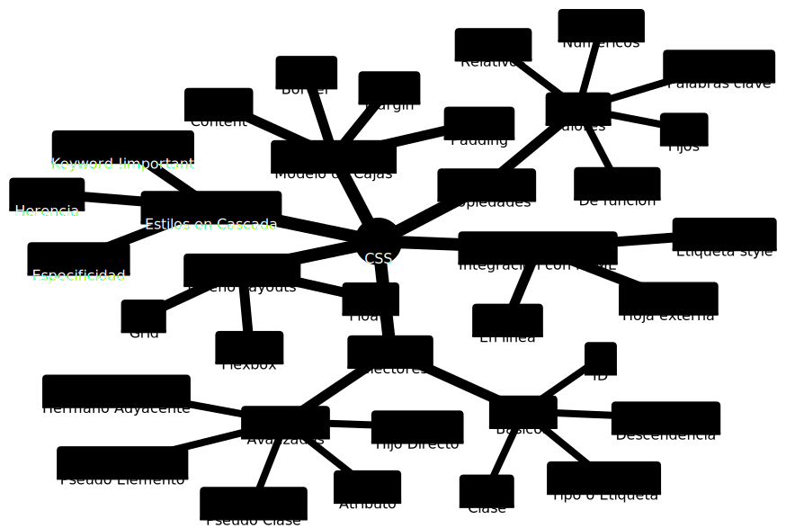

# CSS 

## Fundamentos 
CSS es un lenguaje de estilo utilizado para diseñar y presentar páginas web. A continuación se resumen los fundamentos de CSS:

**Selección de elementos**: CSS permite seleccionar elementos específicos en una página web utilizando selectores. Los selectores pueden ser etiquetas HTML, clases, IDs u otros atributos.

**Propiedades de estilo**: Las propiedades de estilo definen cómo se ve un elemento en una página web. Estas propiedades incluyen el color, la fuente, el tamaño y la posición.

**Reglas de estilo**: Las reglas de estilo combinan un selector y un conjunto de propiedades para definir el estilo de un elemento en una página web.

**Estilos en cascada**: CSS utiliza una técnica llamada "estilos en cascada", que significa que las reglas de estilo se aplican en cascada, lo que significa que se aplican primero las reglas más específicas y luego las reglas menos específicas. También se pueden aplicar estilos heredados de elementos padres a elementos hijos.

**Integración con HTML**: Las hojas de estilo externas se vinculan a una página web utilizando la etiqueta ***link***, mientras que las hojas de estilo internas se definen dentro del documento HTML utilizando la etiqueta ***style***. También es posible usar el atributo ***style***, lo que se conoce como estilo en línea. 

**Modelos de caja**: El modelo de caja de CSS define cómo se representa visualmente un elemento HTML. La caja incluye el contenido, el borde, el margen y el relleno.

**Diseño de Layouts**: CSS ofrece varias técnicas de diseño, como flexbox y CSS grid, que permiten controlar la distribución y el diseño de los elementos en una página web. 

En resumen, CSS permite definir el estilo y la presentación de una página web utilizando selectores, propiedades y reglas de estilo. Las hojas de estilo externas e internas se utilizan para aplicar estos estilos a una página web, mientras que las técnicas de diseño, como flexbox y CSS grid, permiten controlar la distribución y el diseño de los elementos en una página web.

## Selectores CSS 

Los selectores son una parte fundamental del lenguaje CSS, que te permiten seleccionar uno o varios elementos HTML para aplicarles estilos. Hay varios tipos de selectores, y cada uno tiene una sintaxis y uso específicos.

### Selectores CSS Básicos 

1. **Selector de tipo**: este selector selecciona todos los elementos HTML que coincidan con un tipo específico. Por ejemplo, si queremos aplicar un estilo a todos los párrafos en una página, usaríamos el selector de tipo "p".

```css
p {
  color: red;
}
```

2. **Selector de clase**: este selector selecciona todos los elementos HTML que tengan un atributo "class" específico. Las clases son muy útiles para aplicar estilos a grupos de elementos que comparten características comunes.

```css
.my-class {
  color: red;
}

```

3. **Selector de ID**: este selector selecciona un elemento HTML específico que tenga un atributo "id" único. Es importante recordar que cada "id" debe ser único en toda la página.

```css
#my-id {
  color: red;
}

```

4. **Selector de descendencia**: este selector selecciona todos los elementos que son descendientes de un elemento HTML específico. Se usa un espacio para separar el elemento padre del hijo.

```css
div p {
  color: red;
}
```

### Selectores CSS Avanzados 

5. **Selector de hijo directo**: este selector selecciona todos los elementos que son hijos directos de un elemento HTML específico. Se usa el signo ">" para separar el elemento padre del hijo directo.

```css
div > p {
  color: red;
}
```

6. **Selector hermano adyacente**: El selector de elementos hermanos adyacentes (+) se utiliza para seleccionar un elemento que se encuentra justo al lado de otro elemento en el mismo nivel de la jerarquía. Por ejemplo, para seleccionar todos los elementos &lt;img&gt; que aparecen justo después de elementos &lt;p&gt;:

```css
p + img {
  
}
```

7. **Selector de atributo**: Estos selectores permiten seleccionar un elemento solo a partir de la presencia de un atributo (por ejemplo href) o a partir de varias coincidencias diferentes con respecto al valor del atributo.

```css
li[class] {
    font-size: 200%;
}

li[class="a"] {
    background-color: yellow;
}

li[class~="a"] {
    color: red;
}   
```

8. **Pseudo-clases**: las pseudo-clases seleccionan elementos en función de su estado o relación con otros elementos. Se usan con un colon ":" después del selector. Algunas de las pseudo-clases más comunes son:

- :hover: selecciona un elemento cuando el cursor se sitúa sobre él.
- :active: selecciona un elemento cuando está siendo clicado.
- :visited: selecciona un enlace visitado.
- :nth-child(n): selecciona el elemento n-ésimo de un padre.
- :first-child: selecciona el primer hijo de un padre.
- :last-child: selecciona el último hijo de un padre.
- :not(selector): selecciona los elementos que no coinciden con el selector especificado.

```css
a:hover {
  text-decoration: underline;
}

li:first-child {
  font-weight: bold;
}
```


9. **Pseudo-elementos**: los pseudo-elementos seleccionan partes específicas de un elemento, como su primer letra o su contenido después del elemento. Se usan con dos puntos "::" después del selector. Algunos de los pseudo-elementos más comunes son:

- ::before: inserta contenido antes del contenido del elemento seleccionado.
- ::after: inserta contenido después del contenido del elemento seleccionado.
- ::first-letter: selecciona la primera letra de un elemento.
- ::first-line: selecciona la primera línea de texto de un elemento.
- ::selection: selecciona el texto seleccionado por el usuario.

```css
p::first-letter {
  font-size: 2em;
}

h1::before {
  content: "Título: ";
}
```

Es importante tener en cuenta que algunos navegadores pueden no admitir todas las pseudo-clases y pseudo-elementos, por lo que es recomendable verificar su compatibilidad antes de usarlos en un proyecto.


## Propiedades de Estilo 

Algunas de las principales propiedades de estilo CSS que un desarrollador frontend debiera conocer:

- **Propiedades de texto**: estas propiedades te permiten modificar el aspecto del texto, como su tamaño, color, fuente, entre otras. Algunas de las propiedades más comunes son: 

- font-size
- color
- font-family
- text-align
- line-height
- text-decoration

- **Propiedades de fondo**: estas propiedades te permiten establecer el fondo de un elemento, como su color o imagen de fondo. Algunas de las propiedades más comunes son:

- background-color
- background-image
- background-repeat
- background-size 
- background-position

- **Propiedades de borde**: estas propiedades te permiten establecer el borde de un elemento, como su estilo, color y tamaño. Algunas de las propiedades más comunes son: 

- border-style
- border-color
- border-width
- border-radius 
- outline


- **Propiedades de posicionamiento**: estas propiedades te permiten controlar el posicionamiento de los elementos en la página. Algunas de las propiedades más comunes son: 

- position
- top
- bottom
- left
- right
- z-index
- display

- **Propiedades de dimensiones**: estas propiedades te permiten establecer la altura y el ancho de los elementos. Algunas de las propiedades más comunes son:

- height
- width
- max-height
- max-width
- min-height.

- **Propiedades de animación y transición**: estas propiedades te permiten animar y transicionar los elementos en la página. Algunas de las propiedades más comunes son: 

- animation
- transition
- transform
- opacity

- **Propiedades de flexbox y grid**: estas propiedades te permiten crear diseños flexibles y responsivos en la página. Algunas de las propiedades más comunes son display: 

- flex 
- display
- align-items
- justify-content
- grid-template-columns

Estas son solo algunas de las propiedades de estilo CSS que un desarrollador frontend debiera conocer. Hay muchas más propiedades y valores que puedes utilizar para personalizar y dar estilo a tus páginas web. Es importante experimentar y practicar para dominar CSS.

### Valores

Los valores posibles para los atributos CSS se pueden clasificar de varias formas, pero aquí te presento algunas de las más comunes:

1. **Valores fijos**: Estos valores son definidos por el usuario y no cambian. Por ejemplo, un color en formato hexadecimal (#FFFFFF) o un tamaño en píxeles (20px).

1. **Valores relativos**: Estos valores se basan en otros valores y pueden cambiar según el contexto en el que se encuentran. Por ejemplo, el ancho de un elemento puede ser definido como un porcentaje del ancho de su contenedor.

1. **Valores de palabras clave**: Estos valores son palabras específicas que tienen un significado predefinido en CSS. Por ejemplo, "bold" se utiliza para definir un texto en negrita.

1. **Valores numéricos**: Estos valores son números que se utilizan para definir medidas, como el ancho de un borde o el espaciado entre elementos.

1. **Valores de función**: Estos valores utilizan una función específica para generar un valor. Por ejemplo, la función "rgb()" se utiliza para definir un color en formato RGB.

Estas son solo algunas de las formas en que se pueden clasificar los valores posibles para los atributos CSS. Es importante tener en cuenta que, dependiendo del atributo, puede haber otras formas de clasificación.


## Estilos en Cascada 

Los estilos en cascada en CSS se refieren al proceso por el cual se aplican las reglas de estilo a los elementos en una página web. Aquí te presento un resumen de cómo funciona la cascada de estilos en CSS, junto con algunos ejemplos:

1. **Herencia**: algunos estilos se heredan automáticamente de los elementos padres a los elementos hijos. Por ejemplo, si se establece el color de fuente en un elemento body, todos los elementos dentro de ese body heredarán ese color de fuente, a menos que se especifique un color diferente en una regla de estilo posterior.

1. **Prioridad**: cuando hay múltiples reglas de estilo que se aplican a un mismo elemento, se utiliza un sistema de prioridad para determinar cuál regla prevalece. La prioridad se basa en la especificidad del selector, el orden de las reglas en el código, y si se utiliza ***!important*** en alguna de las reglas.

1. **Cascada**: si hay reglas de estilo que se aplican a un mismo elemento y tienen la misma prioridad, se utiliza el orden en que se declaran en el código para determinar cuál regla prevalece. Esto significa que las reglas que aparecen más abajo en el código tienen más peso que las que aparecen más arriba.

```css
body {
  color: blue;
  font-size: 16px;
}

h1 {
  color: red;
  font-size: 2em;
}
```

En este ejemplo, el color de fuente para todos los elementos en la página se establece en azul en la regla body. Sin embargo, para los encabezados de nivel 1 (h1), se establece un color de fuente diferente en rojo. Esto demuestra cómo las reglas de estilo pueden anularse entre sí en función de su especificidad y orden.

En resumen, los estilos en cascada en CSS son un proceso fundamental para aplicar estilos a elementos en una página web. Comprender cómo funcionan la herencia, la prioridad y la cascada de estilos es clave para diseñar páginas web con estilos efectivos y coherentes.

## Modelo de Cajas



El modelo de cajas en CSS se refiere a la manera en que se representa visualmente un elemento HTML en una página web. En CSS, cada elemento es tratado como una caja rectangular que se compone de cuatro áreas principales: el contenido, el padding, el borde y el margen.

El contenido se refiere al espacio que ocupa el contenido real del elemento, como el texto, las imágenes o los videos. El padding es el espacio que se encuentra entre el contenido y el borde del elemento, y se puede ajustar con CSS para dar un mayor espacio entre el contenido y el borde. El borde es la línea que rodea el elemento y puede tener diferentes estilos, grosores y colores. El margen es el espacio que se encuentra fuera del borde y que separa el elemento de otros elementos de la página.

El modelo de cajas en CSS permite controlar el tamaño, la posición y la apariencia visual de los elementos de una página web mediante la manipulación de estas cuatro áreas. También es posible aplicar estilos específicos para cada una de ellas, lo que permite crear diseños más complejos y detallados en una página web.

```html
<div class="mi-caja">Caja 1</div>
<div class="mi-caja">Caja 2</div>
```

```css
.mi-caja {
  width: 200px;
  height: 100px;
  padding: 20px;
  border: 2px solid black;
  margin: 10px;
}
```

En este ejemplo, creamos 2 cajas rectangulares utilizando un elemento HTML div con la clase .mi-caja. En el CSS, establecemos el tamaño de la caja utilizando las propiedades width y height. A continuación, establecemos un espacio de 20 píxeles alrededor del contenido de la caja utilizando la propiedad padding. Agregamos un borde negro de 2 píxeles de grosor alrededor de la caja utilizando la propiedad border, y finalmente establecemos un margen de 10 píxeles alrededor de la caja utilizando la propiedad margin.

Este ejemplo es solo un ejemplo básico, pero el modelo de cajas en CSS ofrece muchas posibilidades para crear diseños más complejos y detallados en una página web.

### Cajas en bloque y en línea

En CSS, en general, hay dos tipos de cajas: 

- Cajas en bloque 
- Cajas en línea 

Estas características se refieren al modo como se comporta la caja en términos de flujo de página y en relación con otras cajas de la página:

Si una caja se define como un bloque, se comportará de las maneras siguientes:

La caja fuerza un salto de línea al llegar al final de la línea.
La caja se extenderá en la dirección de la línea para llenar todo el espacio disponible que haya en su contenedor. En la mayoría de los casos, esto significa que la caja será tan ancha como su contenedor, y llenará el 100% del espacio disponible. Se respetan las propiedades width y height.
El relleno, el margen y el borde mantienen a los otros elementos alejados de la caja. A menos que decidamos cambiar el tipo de visualización a en línea, elementos como los encabezados (por ejemplo, &lt;h1&gt;) y todos los elementos &lt;p&gt; usan por defecto block como tipo de visualización externa.

Si una caja tiene una visualización externa de tipo **inline**, entonces:

La caja no fuerza ningún salto de línea al llegar al final de la línea.
Las propiedades **width y height** no se aplican.
Se aplican relleno, margen y bordes verticales, pero no mantienen alejadas otras cajas en línea.
Se aplican relleno, margen y bordes horizontales, y mantienen alejadas otras cajas en línea.
El elemento &lt;a&gt;, que se utiliza para los enlaces, y los elementos &lt;span&gt;, &lt;em&gt; y &lt;strong&gt; son ejemplos de elementos que se muestran en línea por defecto.

El tipo de caja que se aplica a un elemento está definido por los valores de propiedad **display, como block y inline**, y se relaciona con el valor externo (outer) de visualización (display).

### Visualización interna y externa
En este punto, será mejor que también expliquemos los tipos de visualización interna y externa. Como se mencionó anteriormente, las cajas en CSS tienen un tipo de visualización externa, que define si se trata de una caja en bloque o en línea.

Sin embargo, las cajas también tienen un tipo de visualización interna, que determina cómo se disponen los elementos dentro de esa caja. De forma predeterminada, los elementos dentro de una caja se presentan en flujo normal, lo que significa que se comportan como otros elementos de tipo en bloque o en línea (como se explicó anteriormente).

Sin embargo, podemos cambiar el tipo de visualización interna utilizando valores de display, como **flex**. Si en un elemento establecemos display: flex;, el tipo de visualización **externa** es de tipo bloque (block), pero el tipo de visualización **interna** cambia a flexible (flex). Cualquier elemento que sea hijo directo de esta caja pasará a comportarse como un elemento de tipo flex, de acuerdo con las reglas que se establecen en la especificación de Flexbox, tema que veremos más adelante.


## Layouts usando CSS 

### CSS Flexbox 

CSS Flexbox es una técnica de diseño de CSS que permite crear diseños flexibles y adaptables a diferentes tamaños de pantalla y dispositivos. A continuación se resumen los fundamentos de CSS Flexbox:

**Flex container**: La técnica Flexbox se basa en un contenedor (flex container) que contiene elementos flexibles (flex items).

**Eje principal y eje transversal**: En un contenedor de Flexbox, se define un eje principal y un eje transversal. El eje principal es la dirección en la que se alinean los elementos flexibles, mientras que el eje transversal es perpendicular al eje principal.

**Propiedades del contenedor**: El contenedor Flexbox se puede personalizar mediante propiedades como display, flex-direction, justify-content y align-items. Estas propiedades permiten controlar la dirección, el alineamiento y la distribución de los elementos flexibles dentro del contenedor.

**Propiedades de los elementos flexibles**: Los elementos flexibles (flex items) también se pueden personalizar mediante propiedades como flex-grow, flex-shrink y flex-basis. Estas propiedades permiten controlar el tamaño y el comportamiento de los elementos flexibles dentro del contenedor.

**Diseño responsive**: Flexbox es una técnica de diseño responsive que permite crear diseños que se adaptan automáticamente a diferentes tamaños de pantalla y dispositivos.

**Anidamiento de contenedores**: Los contenedores Flexbox se pueden anidar para crear diseños más complejos y personalizados.

En resumen, CSS Flexbox es una técnica de diseño de CSS que se basa en un contenedor de elementos flexibles. La dirección, el alineamiento y la distribución de los elementos flexibles se controlan mediante propiedades del contenedor, mientras que el tamaño y el comportamiento de los elementos flexibles se controlan mediante propiedades de los elementos. Flexbox es una técnica de diseño responsive que permite crear diseños adaptables a diferentes tamaños de pantalla y dispositivos, y se puede utilizar junto con otras técnicas de diseño de CSS, como CSS grid. 

### CSS Grid 

CSS Grid es una técnica de diseño de CSS que permite crear diseños de página complejos y adaptables a diferentes tamaños de pantalla y dispositivos. A continuación se resumen los fundamentos de CSS Grid:

**Grid container**: La técnica CSS Grid se basa en un contenedor (grid container) que contiene elementos flexibles (grid items).

**Filas y columnas**: En un contenedor de CSS Grid, se define una cuadrícula de filas y columnas. Las filas se definen mediante la propiedad grid-template-rows y las columnas se definen mediante la propiedad grid-template-columns.

**Espacio entre filas y columnas**: CSS Grid permite definir el espacio entre las filas y las columnas mediante la propiedad grid-gap.

**Posicionamiento de elementos**: Los elementos de la cuadrícula se pueden posicionar en las celdas de la cuadrícula mediante las propiedades grid-row y grid-column.

**Diseño responsive**: CSS Grid es una técnica de diseño responsive que permite crear diseños que se adaptan automáticamente a diferentes tamaños de pantalla y dispositivos.

**Anidamiento de cuadrículas**: Las cuadrículas de CSS Grid se pueden anidar para crear diseños más complejos y personalizados.

**Diseño de áreas**: CSS Grid permite definir áreas en la cuadrícula mediante la propiedad grid-template-areas, lo que facilita la creación de diseños complejos con múltiples elementos.

En resumen, CSS Grid es una técnica de diseño de CSS que se basa en un contenedor de elementos flexibles organizados en una cuadrícula de filas y columnas. Las propiedades de la cuadrícula permiten controlar el espacio entre filas y columnas, el posicionamiento de los elementos y la definición de áreas en la cuadrícula. CSS Grid es una técnica de diseño responsive que permite crear diseños adaptables a diferentes tamaños de pantalla y dispositivos, y se puede utilizar junto con otras técnicas de diseño de CSS, como Flexbox.


## Mindmap

 

## Lecturas 

- https://developer.mozilla.org/es/docs/Web/CSS 

- https://developer.mozilla.org/es/docs/Web/CSS/Reference

- https://www.w3schools.com/css/default.asp 

- https://www.w3schools.com/cssref/index.php 

- https://www.w3schools.com/cssref/css_selectors.php 

- https://developer.mozilla.org/es/docs/Learn/CSS/Building_blocks/The_box_model 

- https://developer.mozilla.org/es/docs/Learn/CSS/Building_blocks/Selectors/Attribute_selectors
