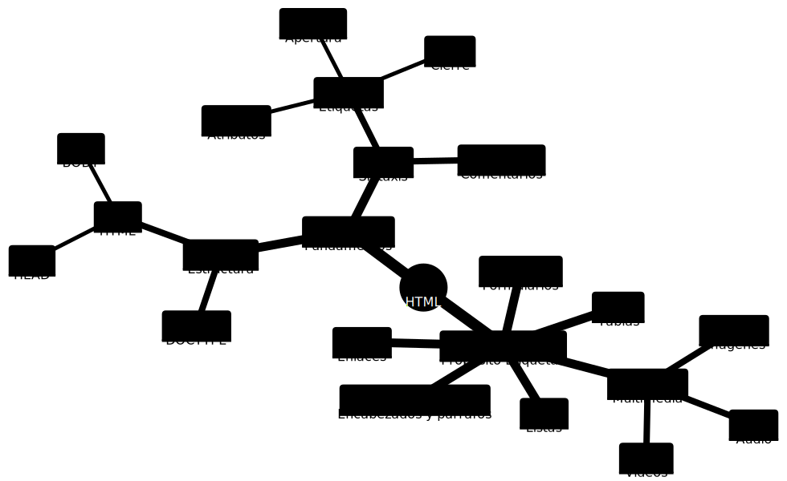

# HTML 

## Fundamentos de HTML 

HTML es un lenguaje de marcado que se utiliza para crear páginas web. A continuación se resumen los fundamentos de HTML:

**Estructura básica**: Todo documento HTML comienza con el elemento html, que contiene dos elementos principales: ***head y body***. El elemento head contiene información sobre el documento, como el título de la página y los enlaces a las hojas de estilo CSS, mientras que el elemento body contiene el contenido visible de la página.

**Etiquetas y elementos**: Los elementos de HTML se definen utilizando etiquetas. Cada etiqueta comienza con el símbolo < y termina con el símbolo >. Los elementos pueden contener texto, imágenes, enlaces y otros elementos. Algunos elementos, como las imágenes y los enlaces, requieren atributos para funcionar correctamente.

**Encabezados y párrafos**: Los encabezados se utilizan para dividir el contenido de la página en secciones y se definen utilizando las etiquetas ***h1 a h6***. Los párrafos se definen utilizando la ***etiqueta p*** y se utilizan para agrupar el texto en párrafos.

**Enlaces**: Los enlaces se definen utilizando la ***etiqueta a*** y se utilizan para crear hipervínculos a otras páginas web o a secciones de la misma página.

**Imágenes**: Las imágenes se definen utilizando la ***etiqueta img*** y requieren un ***atributo src*** para especificar la ubicación del archivo de imagen.

**Listas**: Las listas se definen utilizando las etiquetas ***ul (lista sin orden), ol (lista ordenada)*** y ***li (elemento de lista)***.

**Tablas**: Las tablas se definen utilizando las ***etiquetas table, tr (fila de tabla) y td (celda de tabla)*** y se utilizan para mostrar datos en forma de tabla.

**Multimedia**: HTML5 introduce nuevas etiquetas que permiten la inserción y reproducción de contenido multimedia, como el video y el audio, directamente en las páginas web. Las etiquetas <video> y <audio> permiten definir la ubicación de los archivos de audio y video, así como especificar su formato y otras opciones de reproducción, como el control de volumen y la reproducción automática. Además, estas etiquetas proporcionan una manera fácil de agregar subtítulos y otros metadatos al contenido multimedia, lo que mejora la accesibilidad y la experiencia del usuario. 

**Formularios**: Los formularios se definen utilizando la ***etiqueta form*** y se utilizan para recopilar datos de los usuarios. Los elementos de formulario, como los campos de texto y los botones, se definen utilizando ***etiquetas específicas, como input y button***.

En resumen, HTML proporciona las herramientas necesarias para crear páginas web mediante el uso de etiquetas y elementos para definir la estructura y el contenido de la página, así como para crear interactividad con los usuarios mediante el uso de formularios y enlaces.

## Sintaxis HTML 

### Etiquetas 
Las etiquetas son elementos que definen y estructuran el contenido de una página web. Cada etiqueta se escribe entre corchetes angulares (< y >) y puede tener atributos para proporcionar información adicional sobre el elemento.

Un ejemplo de etiqueta básica sería:

```html 
<p>Este es un párrafo de ejemplo</p>
```

En este ejemplo, la etiqueta ***P*** define un párrafo.

### Atributos 
Los atributos son propiedades que se aplican a una etiqueta y se utilizan para proporcionar información adicional sobre el elemento. Los atributos se escriben dentro de la etiqueta y se componen de un nombre y un valor, separados por un signo igual (=).

Un ejemplo de etiqueta con atributos sería:

```html

```

En este ejemplo, la etiqueta  define una imagen. Los atributos src y alt proporcionan información sobre la ubicación de la imagen y una descripción alternativa para la imagen, respectivamente.

### Etiqueta de apertura y cierre 

En HTML5, la mayoría de las etiquetas requieren tanto una etiqueta de apertura como una etiqueta de cierre para definir el contenido que se encuentra entre ellas. La etiqueta de apertura se escribe con el nombre de la etiqueta y se coloca entre corchetes angulares (< y >), mientras que la etiqueta de cierre se escribe con una barra diagonal (/) antes del nombre de la etiqueta y se coloca entre corchetes angulares.

En este ejemplo, la etiqueta de apertura ***P*** define un párrafo y la etiqueta de cierre indica el final del párrafo.

Algunas etiquetas en HTML5, como la etiqueta ***IMG***, no requieren una etiqueta de cierre porque no contienen contenido entre ellas. En estos casos, la etiqueta de apertura se escribe con un signo de cierre (/) al final.

Es importante asegurarse de que todas las etiquetas de apertura tengan su correspondiente etiqueta de cierre para evitar errores en el código HTML.

```html
<p>Este es un párrafo de ejemplo</p>


```

Hay varias etiquetas de HTML que no requieren una etiqueta de cierre y se consideran etiquetas "autocerrantes". Algunas de ellas son:

**&lt;br&gt;**: se utiliza para agregar un salto de línea en una página web y no requiere una etiqueta de cierre.

**&lt;img&gt;**: se utiliza para insertar imágenes en una página web y no requiere una etiqueta de cierre.

**&lt;input&gt;**: se utiliza para crear campos de entrada de datos en una página web y no requiere una etiqueta de cierre.

**&lt;meta&gt;**: se utiliza para proporcionar información meta sobre una página web, como la descripción, palabras clave y codificación de caracteres, y no requiere una etiqueta de cierre.

**&lt;link&gt;**: se utiliza para enlazar archivos externos como hojas de estilo CSS y fuentes de Google Fonts y no requiere una etiqueta de cierre.


### Comentarios
Además, HTML también incluye la posibilidad de agregar comentarios en el código. Los comentarios son notas que se agregan al código para proporcionar información adicional o para recordar a los programadores lo que hace una sección específica del código. Los comentarios en HTML se escriben entre <!-- y -->.

Un ejemplo de comentario en HTML sería:

```html
<!-- Este es un comentario en HTML -->
```

En resumen, la sintaxis de HTML se compone de etiquetas, que definen y estructuran el contenido de una página web, y atributos, que proporcionan información adicional sobre una etiqueta. También se pueden agregar comentarios para proporcionar información adicional sobre el código.

## Estructura Básica 

La estructura básica de un documento HTML consta de tres partes principales: ***la declaración DOCTYPE, el elemento head y el elemento body.***

### DOCTYPE 
La declaración DOCTYPE es la primera línea del documento HTML y se utiliza para indicar el tipo de documento HTML que se está utilizando. Esta declaración no es un elemento HTML, sino una instrucción que le dice al navegador cómo procesar el código HTML. La declaración DOCTYPE se escribe como sigue:

```html
<!DOCTYPE html>
```

### HEAD
El elemento head es un contenedor para metadatos (información sobre el documento) y enlaces a archivos externos como hojas de estilo CSS y scripts JavaScript. Los metadatos incluyen información como el título de la página, la descripción y palabras clave que los motores de búsqueda pueden utilizar para clasificar y encontrar la página. El elemento head se escribe dentro del elemento HTML y antes del elemento body. Un ejemplo de un elemento head básico se muestra a continuación:

```html
<head>
    <meta charset="UTF-8">
    <title>Título de la página</title>
    <meta name="description" content="Descripción de la página">
    <meta name="keywords" content="palabra clave 1, palabra clave 2, palabra clave 3">
    <link rel="stylesheet" href="style.css">
    <script src="script.js"></script>
</head>
```

### BODY 

El elemento body es el contenedor principal para el contenido de la página. ***Incluye todo el texto, imágenes, videos y otros elementos visuales*** que se muestran en la página. El elemento body se escribe después del elemento head y se cierra al final del documento. Un ejemplo de un elemento body básico se muestra a continuación:

```html
<body>
    <h1>Título principal de la página</h1>
    <p>Este es un párrafo de ejemplo.</p>
    
</body>

```

### Ejemplo estructura completa

En resumen, la estructura básica de un documento HTML incluye la declaración DOCTYPE, el elemento head y el elemento body. La declaración DOCTYPE indica el tipo de documento HTML que se está utilizando, el elemento head contiene información sobre el documento y enlaces a archivos externos, y el elemento body contiene el contenido principal de la página. A continuación se muestra un ejemplo completo de un documento HTML que utiliza la estructura básica:

```html
<!DOCTYPE html>
<html>
<head>
    <meta charset="UTF-8">
    <title>Título de la página</title>
    <meta name="description" content="Descripción de la página">
    <meta name="keywords" content="palabra clave 1, palabra clave 2, palabra clave 3">
    <link rel="stylesheet" href="style.css">
    <script src="script.js"></script>
</head>
<body>
    <h1>Título principal de la página</h1>
    <p>Este es un párrafo de ejemplo.</p>
    <!-- falta agregar más información -->
    
</body>
</html>

```

## Etiquetas

### Encabezados y párrafos 

En HTML, los encabezados se utilizan para indicar la importancia y jerarquía del contenido en una página web, mientras que los párrafos se utilizan para agrupar y presentar contenido textual.

Los encabezados se indican mediante etiquetas de "h1" a "h6", donde "h1" representa el encabezado más importante y "h6" el menos importante. 

```html
<!DOCTYPE html>
<html>
<head>
	<title>Ejemplo de encabezados y párrafos en HTML</title>
</head>
<body>
	<h1>Encabezado de nivel 1</h1>
	<p>Este es un párrafo que contiene un ejemplo de encabezado de nivel 2:</p>
	<h2>Encabezado de nivel 2</h2>
	<p>Este es otro párrafo que contiene un ejemplo de encabezado de nivel 3:</p>
	<h3>Encabezado de nivel 3</h3>
	<p>Este es un párrafo que contiene varios ejemplos de encabezados:</p>
	<h4>Encabezado de nivel 4</h4>
	<h5>Encabezado de nivel 5</h5>
	<h6>Encabezado de nivel 6</h6>
	<p>Este es un párrafo que contiene más texto después de los encabezados.</p>
</body>
</html>
```

### Enlaces 

En HTML, los enlaces se utilizan para crear hipervínculos a otras páginas web o recursos en línea, como imágenes, archivos de audio o video, documentos PDF, etc. Los enlaces se crean utilizando la etiqueta "A", que significa "ancla". La etiqueta "A" se utiliza junto con el atributo "href", que especifica la URL del recurso al que se desea enlazar.

Por ejemplo, para crear un enlace a la página principal de Google, se utilizaría el siguiente código:

```html
<a href="https://www.google.com">Ir a Google</a>
```

En este ejemplo, "https://www.google.com" es la URL del recurso al que se desea enlazar, y "Ir a Google" es el texto del enlace que se mostrará en la página. Cuando el usuario haga clic en el texto del enlace, se abrirá la página de Google en una nueva pestaña del navegador.

Además del atributo "href", la etiqueta "<a>" también puede incluir otros atributos, como "target" para especificar dónde se abrirá el recurso vinculado (por ejemplo, en una nueva pestaña del navegador), "title" para proporcionar información adicional sobre el recurso vinculado, y "rel" para especificar la relación entre la página actual y la página vinculada.

Por ejemplo, para crear un enlace a un archivo de audio llamado "mi_cancion.mp3" que se encuentra en el mismo directorio que la página actual, se utilizaría el siguiente código:

```html
<a href="mi_cancion.mp3" target="_blank" title="Escuchar mi canción">Mi canción</a>
```

En este ejemplo, el atributo "href" se establece en "mi_cancion.mp3" para indicar que se trata de un archivo de audio en lugar de una página web. El atributo "target" se establece en "_blank" para indicar que se abrirá el archivo de audio en una nueva pestaña del navegador. El atributo "title" se establece en "Escuchar mi canción" para proporcionar información adicional sobre el recurso vinculado. "Mi canción" es el texto del enlace que se mostrará en la página. Cuando el usuario haga clic en el texto del enlace, se abrirá el archivo de audio en una nueva pestaña del navegador.

### Imágenes 

En HTML, las imágenes se insertan en una página utilizando la etiqueta "IMG". La etiqueta "IMG" es un elemento vacío, lo que significa que no tiene una etiqueta de cierre. En su lugar, se utilizan los atributos para indicar la información necesaria para mostrar la imagen.

El atributo más importante de la etiqueta "IMG" es "src", que especifica la URL de la imagen que se desea mostrar. Otros atributos útiles incluyen "alt" para proporcionar una descripción de la imagen para las personas con discapacidades visuales, "width" y "height" para especificar las dimensiones de la imagen en píxeles, y "title" para proporcionar información adicional sobre la imagen.

Por ejemplo, para insertar una imagen de un gato llamado "michi.jpg" que se encuentra en el mismo directorio que la página actual, se utilizaría el siguiente código:

```html

```

En este ejemplo, "michi.jpg" es la URL de la imagen que se desea mostrar, y "Foto de un gato llamado Michi" es una descripción alternativa de la imagen para las personas con discapacidades visuales. Cuando se muestra la página, se mostrará la imagen de Michi en su tamaño original.

```html

```

En este ejemplo, la imagen de Michi se muestra con un borde negro sólido, y se ha aplicado la clase "imagen-gato" y el identificador "michi-foto" para poder aplicar estilos o referirse a la imagen de manera única en el futuro.


### Listas 

En HTML, las listas se utilizan para presentar información en un formato estructurado y fácilmente legible. Hay tres tipos de listas en HTML: listas ordenadas, listas desordenadas y listas de definición.

Las listas ordenadas se utilizan cuando se necesita presentar información en un orden específico. Se indican mediante la etiqueta "OL". Cada elemento de la lista se indica con la etiqueta "LI". Por ejemplo, para crear una lista ordenada de números del 1 al 5, se utiliza la siguiente estructura:

```html
<ol>
	<li>1</li>
	<li>2</li>
	<li>3</li>
	<li>4</li>
	<li>5</li>
</ol>
```

Las listas desordenadas se utilizan para presentar información en un orden no específico. Se indican mediante la etiqueta "UL". Cada elemento de la lista se indica con la etiqueta "LI". Por ejemplo, para crear una lista desordenada de frutas, se utiliza la siguiente estructura:

```html
<ul>
	<li>Manzana</li>
	<li>Pera</li>
	<li>Banana</li>
	<li>Naranja</li>
</ul>
```

Las listas de definición se utilizan para presentar información en un formato de "término-definición". Se indican mediante la etiqueta "DL". Cada término se indica con la etiqueta "DT", y cada definición se indica con la etiqueta "DD". Por ejemplo, para crear una lista de definición de términos informáticos, se utiliza la siguiente estructura:

```html
<dl>
	<dt>HTML</dt>
	<dd>Lenguaje de marcado utilizado para crear páginas web.</dd>
	<dt>CSS</dt>
	<dd>Lenguaje utilizado para dar estilo y diseño a páginas web.</dd>
	<dt>JavaScript</dt>
	<dd>Lenguaje de programación utilizado para crear interactividad en páginas web.</dd>
</dl>
```


### Tablas 

#### Tablas Básicas 

HTML5 proporciona una manera fácil y sencilla de crear tablas en una página web. Para crear una tabla, primero necesitas el elemento &lt;table&gt;. Luego, dentro de la etiqueta de apertura y cierre de la tabla, debes agregar las etiquetas de fila &lt;tr&gt; y las etiquetas de celda &lt;td&gt; o &lt;th&gt;. Las etiquetas &lt;td&gt; se utilizan para las celdas regulares de la tabla, mientras que las etiquetas &lt;th&gt; se utilizan para las celdas de encabezado.

Aquí hay un ejemplo de una tabla HTML5 básica con dos filas y dos columnas:

```html
<table>
  <tr>
    <th>Encabezado 1</th>
    <th>Encabezado 2</th>
  </tr>
  <tr>
    <td>Celda 1</td>
    <td>Celda 2</td>
  </tr>
</table>
```

En este ejemplo, hay dos filas: una fila de encabezado y una fila de celdas regulares. La etiqueta &lt;th&gt; se utiliza para las celdas de encabezado, mientras que la etiqueta &lt;td&gt; se utiliza para las celdas regulares.

#### Secciones de la Tabla

HTML proporciona algunas etiquetas adicionales que se pueden utilizar en una tabla para definir encabezados y pies de tabla, así como para agrupar filas y columnas.

Aquí están algunas de las etiquetas de tabla adicionales que puedes utilizar:

**&lt;thead&gt;**: Esta etiqueta se utiliza para definir la sección de encabezado de la tabla. Normalmente se utiliza para agregar una fila de encabezado a la tabla utilizando la etiqueta &lt;th&gt;

**&lt;tbody&gt;**: se utiliza para agrupar las filas regulares de la tabla. 

**&lt;tfoot&gt;**: Esta etiqueta se utiliza para definir la sección de pie de tabla. Normalmente se utiliza para agregar una fila de totales o resúmenes a la tabla.

```html
<table>
  <thead>
    <tr>
      <th>Nombre</th>
      <th>Edad</th>
      <th>País</th>
    </tr>
  </thead>
  <tbody>
    <tr>
      <td>María</td>
      <td>28</td>
      <td>México</td>
    </tr>
    <tr>
      <td>John</td>
      <td>35</td>
      <td>Estados Unidos</td>
    </tr>
  </tbody>
  <tfoot>
    <tr>
      <td colspan="3">Total de personas: 2</td>
    </tr>
  </tfoot>
</table>
```

En este ejemplo, la etiqueta &lt;tfoot&gt; se utiliza para agrupar la fila de pie, que contiene una sola celda que abarca las tres columnas de la tabla utilizando el atributo ***colspan***.

#### Tablas Complejas 

El atributo ***"scope"*** en las tablas HTML se utiliza para asociar celdas de encabezado con celdas de datos. Esto es útil para mejorar la accesibilidad y la semántica de la tabla, ya que ayuda a los lectores de pantalla a comprender la relación entre los encabezados y los datos. A continuación se muestran algunos ejemplos para ilustrar cómo se utiliza el atributo "scope" en las tablas HTML:

Asociar celdas de encabezado con celdas de datos en una tabla simple:

```html
<table>
  <thead>
    <tr>
      <th scope="col">Nombre</th>
      <th scope="col">Edad</th>
      <th scope="col">País</th>
    </tr>
  </thead>
  <tbody>
    <tr>
      <td>María</td>
      <td>28</td>
      <td>España</td>
    </tr>
    <tr>
      <td>Juan</td>
      <td>35</td>
      <td>México</td>
    </tr>
  </tbody>
</table>
```

En este ejemplo, las celdas de ***encabezado*** se definen con el atributo ***"scope"*** establecido en "col" para indicar que se aplican a todas las celdas de la columna. Esto significa que las celdas de encabezado "Nombre", "Edad" y "País" están asociadas con todas las celdas de datos de la columna correspondiente.

Ahora un ejemplo más complejo:

```html
<table>
  <thead>
    <tr>
      <th></th>
      <th scope="colgroup" colspan="2">Semana 1</th>
      <th scope="colgroup" colspan="2">Semana 2</th>
    </tr>
    <tr>
      <th scope="col">Día</th>
      <th scope="col">Mañana</th>
      <th scope="col">Tarde</th>
      <th scope="col">Mañana</th>
      <th scope="col">Tarde</th>
    </tr>
  </thead>
  <tbody>
    <tr>
      <th scope="row">Lunes</th>
      <td>8:00 am</td>
      <td>1:00 pm</td>
      <td>9:00 am</td>
      <td>2:00 pm</td>
    </tr>
    <tr>
      <th scope="row">Martes</th>
      <td>8:30 am</td>
      <td>1:30 pm</td>
      <td>9:30 am</td>
      <td>2:30 pm</td>
    </tr>
  </tbody>
</table>
```

El atributo scope solo se usa en las etiquetas de encabezado de una tabla (es decir, las etiquetas th). El propósito de este atributo es proporcionar información sobre el alcance de la celda de encabezado en relación con las celdas de datos asociadas. Al indicar el alcance, se puede hacer que la tabla sea más accesible para las personas que utilizan tecnologías de asistencia, como lectores de pantalla.

Por otro lado, las etiquetas de datos de una tabla (es decir, las etiquetas td) no necesitan tener el atributo scope, ya que no son celdas de encabezado.

Existe otra alternativa para mejorar la accesibilidad de una tabla, me refiero al atributo ***headers***.

El uso del atributo headers no es obligatorio en una tabla, pero se recomienda su uso en ciertas situaciones para mejorar la accesibilidad y la usabilidad de la tabla.

El atributo headers es especialmente útil cuando hay celdas de datos que se extienden a través de varias celdas de encabezado. En estos casos, es difícil para los lectores de pantalla y otros dispositivos de asistencia determinar a qué celdas de encabezado se refiere la celda de datos.

Por ejemplo, si tienes una tabla que muestra los horarios de clase, y una celda de datos muestra que una clase de matemáticas tiene lugar los martes a las 9:00 am, y se extiende a través de dos celdas de encabezado ("Martes" y "9:00 am"), entonces utilizar el atributo headers para indicar las celdas de encabezado asociadas puede hacer que la tabla sea más accesible.

Además, el uso del atributo headers también puede ser útil cuando se necesita hacer referencia a celdas de encabezado específicas desde fuera de la tabla (por ejemplo, mediante enlaces o scripts). En estos casos, tener id únicos en las celdas de encabezado y utilizar el atributo headers para asociar celdas de datos con celdas de encabezado puede hacer que sea más fácil referirse a las celdas de la tabla desde otros lugares en el documento.

```html
<table>
  <thead>
    <tr>
      <th></th>
      <th id="lunes" scope="col">Lunes</th>
      <th id="martes" scope="col">Martes</th>
      <th id="miercoles" scope="col">Miércoles</th>
    </tr>
  </thead>
  <tbody>
    <tr>
      <th id="hora1" scope="row">8:00 am</th>
      <td headers="lunes hora1">Clase de matemáticas</td>
      <td headers="martes hora1">Clase de ciencias</td>
      <td headers="miercoles hora1">Clase de historia</td>
    </tr>
    <tr>
      <th id="hora2" scope="row">9:00 am</th>
      <td headers="lunes hora2">Clase de literatura</td>
      <td headers="martes hora2">Clase de matemáticas</td>
      <td headers="miercoles hora2">Clase de inglés</td>
    </tr>
    <tr>
      <th id="hora3" scope="row">10:00 am</th>
      <td headers="lunes hora3">Clase de historia</td>
      <td headers="martes hora3">Clase de literatura</td>
      <td headers="miercoles hora3">Clase de ciencias</td>
    </tr>
  </tbody>
</table>

```

### Multimedia  

#### Audio 

Este ejemplo muestra cómo insertar un archivo de audio en una página web con controles de reproducción y dos etiquetas &lt;source&gt; que proporcionan diferentes formatos de archivo de audio. Si el navegador no puede reproducir el archivo de audio, se mostrará el mensaje "Tu navegador no soporta la etiqueta audio.".

```html
<audio controls>
  <source src="audio.mp3" type="audio/mpeg">
  <source src="audio.ogg" type="audio/ogg">
  Tu navegador no soporta la etiqueta audio.
</audio>
```


#### Video

Este ejemplo muestra cómo insertar un archivo de video en una página web con controles de reproducción y dos etiquetas &lt;source&gt; que proporcionan diferentes formatos de archivo de video. El ancho y alto del video se especifican en los atributos "width" y "height". Si el navegador no puede reproducir el archivo de video, se mostrará el mensaje "Tu navegador no soporta la etiqueta video.".

```html
<video controls width="600" height="400">
  <source src="video.mp4" type="video/mp4">
  <source src="video.webm" type="video/webm">
  Tu navegador no soporta la etiqueta video.
</video>
```

#### Picture 

La etiqueta &lt;picture&gt; permite proporcionar varias imágenes en diferentes tamaños y resoluciones, para que el navegador pueda elegir la imagen más adecuada para el dispositivo del usuario y la velocidad de conexión a Internet. La etiqueta &lt;picture&gt; se utiliza en combinación con la etiqueta &lt;source&gt; para proporcionar diferentes imágenes en diferentes formatos y resoluciones, y la etiqueta &lt;img&gt; para proporcionar una imagen de respaldo en caso de que no se pueda cargar ninguna de las imágenes especificadas.

Aquí te dejo un ejemplo de cómo utilizar la etiqueta &lt;picture&gt;:

```html
<picture>
  <source media="(min-width: 768px)" srcset="imagen-grande.jpg">
  <source media="(min-width: 576px)" srcset="imagen-mediana.jpg">
  
</picture>
```

En este ejemplo, se proporcionan tres imágenes diferentes para diferentes tamaños de pantalla. Si el ancho de la pantalla es mayor o igual a 768 píxeles, se mostrará la imagen grande, si es mayor o igual a 576 píxeles, se mostrará la imagen mediana, y si es menor que 576 píxeles, se mostrará la imagen pequeña. Si ninguna de las imágenes especificadas puede ser cargada, se mostrará la imagen de respaldo especificada en el atributo "src" de la etiqueta &lt;img&gt;.

#### Figure

La etiqueta figure en HTML se utiliza para agregar contenido multimedia (como imágenes, videos, gráficos, etc.) a una página web, junto con una leyenda que describe el contenido. Esta etiqueta es especialmente útil para contenido visual, ya que permite separar el contenido visual del resto del contenido de la página, lo que hace que la página sea más accesible para los usuarios con discapacidad visual y permite que los motores de búsqueda indexen mejor el contenido.

Aquí hay un ejemplos de cómo se puede utilizar:

```html
<!-- figure and image tag -->
<figure>
  
  <figcaption>Esta es una imagen de ejemplo</figcaption>
</figure>

<!-- figure and video tag -->
<figure>
  <video controls>
    <source src="ejemplo.mp4" type="video/mp4">
    <source src="ejemplo.webm" type="video/webm">
    Tu navegador no soporta el elemento de video.
  </video>
  <figcaption>Este es un video de ejemplo</figcaption>
</figure>

<!-- figure and picture tag -->
<figure>
  <picture>
    <source srcset="imagen-small.jpg" media="(max-width: 768px)">
    <source srcset="imagen-medium.jpg" media="(max-width: 1024px)">
    
  </picture>
  <figcaption>Esta es una imagen de ejemplo</figcaption>
</figure>

```


### Formularios 

Los formularios en HTML permiten a los usuarios enviar información a un servidor web. El proceso de envío de información comienza cuando el usuario completa y envía el formulario haciendo clic en el botón de envío.

Para crear un formulario en HTML5, se utiliza la etiqueta &lt;form&gt;. La etiqueta &lt;form&gt; envuelve los elementos de entrada y define los atributos del formulario, como la acción (la página web que procesa los datos), el método de envío (GET o POST) y otros atributos opcionales, como el encabezado y el pie de página.

Los elementos de entrada se utilizan para recopilar información del usuario y se pueden incluir en un formulario utilizando etiquetas como &lt;input&gt;, &lt;select&gt;, &lt;textarea&gt;, &lt;label&gt;, entre otras. Cada etiqueta de entrada tiene atributos específicos que se pueden utilizar para controlar el comportamiento y la apariencia del elemento, como el tipo de entrada (texto, fecha, número, etc.), el tamaño, el valor predeterminado, etc.

Una vez que el usuario completa y envía el formulario, los datos se envían al servidor web utilizando el método especificado en el atributo del formulario 'method' (GET o POST). El servidor web procesa los datos y devuelve una respuesta al usuario.

Es importante destacar que, a diferencia de otras tecnologías web como JavaScript, HTML no proporciona una funcionalidad interactiva para los formularios. Por lo tanto, la validación de los datos del formulario y otras funciones interactivas requieren JavaScript o alguna otra tecnología.

Ejemplo de formulario de inicio de sesión:

```html
<form action="/login" method="post">
  <label for="username">Usuario:</label>
  <input type="text" id="username" name="username"><br>

  <label for="password">Contraseña:</label>
  <input type="password" id="password" name="password"><br>

  <input type="submit" value="Iniciar sesión">
</form>
```

En este ejemplo, se utiliza el método POST para enviar los datos de inicio de sesión al servidor web. Los campos de entrada incluyen un campo de texto para el nombre de usuario y un campo de contraseña para la contraseña. Al hacer clic en el botón de envío, los datos se envían al servidor web y se procesan.

Ejemplo de formulario de contacto:

```html
<form action="/contacto" method="post">
  <label for="name">Nombre:</label>
  <input type="text" id="name" name="name"><br>

  <label for="email">Correo electrónico:</label>
  <input type="email" id="email" name="email"><br>

  <label for="message">Mensaje:</label>
  <textarea id="message" name="message"></textarea><br>

  <input type="submit" value="Enviar">
</form>
```

En este ejemplo, se utiliza el método POST para enviar los datos de contacto al servidor web. Los campos de entrada incluyen un campo de texto para el nombre, un campo de correo electrónico y un campo de mensaje de texto. Al hacer clic en el botón de envío, los datos se envían al servidor web y se procesan.

Es importante mencionar que estos ejemplos son solo básicos y no incluyen la validación de datos, por lo que se deben implementar medidas de seguridad adicionales para evitar ataques malintencionados.

Resumen de etiquetas para formularios:

**&lt;form&gt;**: Crea un formulario y envuelve todos los elementos del formulario.

**&lt;input&gt;**: Crea un campo de entrada para el usuario, como un campo de texto, un botón de opción, una casilla de verificación, un botón de radio, un campo de fecha, un campo de número, un campo de correo electrónico, entre otros.

**&lt;label&gt;**: Asocia una etiqueta con un campo de entrada, lo que ayuda a mejorar la accesibilidad y la usabilidad de los formularios.

**&lt;select&gt;**: Crea un menú desplegable de opciones para que el usuario seleccione una opción.

**&lt;option&gt;**: Define una opción en un menú desplegable o una lista de opciones.

**&lt;textarea&gt;**: Crea un campo de texto de varias líneas para que el usuario ingrese información.

**&lt;button&gt;**: Crea un botón que se puede utilizar para enviar un formulario o para realizar alguna otra acción en el lado del cliente.

**&lt;fieldset&gt;**: Agrupa varios elementos de entrada juntos y los rodea con un borde y un título opcional.

**&lt;legend&gt;**: Proporciona un título para un campo de entrada agrupado en un elemento de campo.

**&lt;datalist&gt;**: Proporciona una lista de opciones para un campo de entrada de texto.

**&lt;output&gt;**: Muestra el resultado de un cálculo o una acción en el lado del cliente.

**&lt;progress&gt;**: Muestra el progreso de una tarea en el lado del cliente.

Estas son algunas de las etiquetas más comunes que se utilizan en los formularios de HTML5, aunque existen otras etiquetas menos utilizadas y específicas.

```html
<form action="/procesar-formulario" method="post">
  <fieldset>
    <legend>Datos personales:</legend>
    <label for="nombre">Nombre:</label>
    <input type="text" id="nombre" name="nombre" required><br>

    <label for="apellido">Apellido:</label>
    <input type="text" id="apellido" name="apellido" required><br>

    <label for="fecha_nacimiento">Fecha de nacimiento:</label>
    <input type="date" id="fecha_nacimiento" name="fecha_nacimiento" required><br>

    <label for="correo">Correo electrónico:</label>
    <input type="email" id="correo" name="correo" required><br>
  </fieldset>

  <fieldset>
    <legend>Datos de la cuenta:</legend>
    <label for="nombre_usuario">Nombre de usuario:</label>
    <input type="text" id="nombre_usuario" name="nombre_usuario" minlength="6" required><br>

    <label for="contrasena">Contraseña:</label>
    <input type="password" id="contrasena" name="contrasena" minlength="8" required><br>

    <label for="confirmar_contrasena">Confirmar contraseña:</label>
    <input type="password" id="confirmar_contrasena" name="confirmar_contrasena" minlength="8" required><br>
  </fieldset>

  <fieldset>
    <legend>Preferencias:</legend>
    <label for="ciudad">Ciudad de residencia:</label>
    <select id="ciudad" name="ciudad" required>
      <option value="">Seleccione una opción</option>
      <option value="Bogotá">Bogotá</option>
      <option value="Medellín">Medellín</option>
      <option value="Cali">Cali</option>
      <option value="Barranquilla">Barranquilla</option>
    </select><br>

    <label for="genero">Género:</label>
    <label><input type="radio" name="genero" value="hombre" required> Hombre</label>
    <label><input type="radio" name="genero" value="mujer"> Mujer</label><br>

    <label for="hobbies">Hobbies:</label>
    <input type="text" id="hobbies" name="hobbies" list="lista_hobbies">
    <datalist id="lista_hobbies">
      <option value="Leer">
      <option value="Ver películas">
      <option value="Practicar deportes">
      <option value="Jugar videojuegos">
      <option value="Cocinar">
      <option value="Bailar">
    </datalist>
  </fieldset>

  <fieldset>
    <legend>Comentarios:</legend>
    <label for="comentarios">Comentarios:</label>
    <textarea id="comentarios" name="comentarios"></textarea><br>
  </fieldset>

  <button type="submit">Enviar formulario</button>
</form>
```

Ejemplo con eventos y javascript:

```html
<form onsubmit="resultado.value = parseInt(num1.value) + parseInt(num2.value); progreso.value = 100; return false;"
      onreset="progreso.value=0"
  >
  <fieldset>
    <legend>Suma:</legend>
    <label for="num1">Primer número:</label>
    <input type="number" id="num1" name="num1" required><br>

    <label for="num2">Segundo número:</label>
    <input type="number" id="num2" name="num2" required><br>

    <label for="resultado">Resultado:</label>
    <output for="num1 num2" id="resultado"></output><br>

    <label for="progreso">Progreso:</label>
    <progress id="progreso" value="0" max="100"></progress>
  </fieldset>

  <button type="submit">Calcular</button>
  <button type="reset">Limpiar</button>
</form>
```

## Divitis (DIV)

La "divitis" es un término que se utiliza para referirse a la sobreutilización de elementos div en un documento HTML, lo que puede conducir a una estructura de código ineficiente, difícil de mantener y poco semántica. Aquí te presento algunas recomendaciones para evitar la divitis en HTML:

**Utiliza elementos semánticos**: Los elementos HTML5 como ***header, nav, main, section, article, aside y footer*** proporcionan una estructura semántica clara y significativa al contenido de la página. Utiliza estos elementos siempre que sea posible para definir la estructura del contenido de la página.

**Agrupa elementos con contenedores semánticos**: En lugar de envolver cada elemento con un elemento div genérico, utiliza contenedores semánticos para agrupar los elementos relacionados. Por ejemplo, puedes usar un elemento aside para agrupar los elementos de la barra lateral, o un elemento section para agrupar los elementos relacionados de una sección de contenido.

**Utiliza clases y atributos personalizados**: Si necesitas aplicar estilos específicos a un conjunto de elementos, utiliza clases en lugar de elementos div genéricos. Además, puedes utilizar atributos personalizados para describir la función de los elementos en la página, como data-nav para indicar que un elemento es parte de la navegación.

**Simplifica el código HTML**: Evita anidar elementos div innecesariamente. En su lugar, utiliza clases y contenedores semánticos para agrupar y estructurar el contenido.

**Utiliza CSS para aplicar estilos**: En lugar de utilizar elementos div para aplicar estilos, utiliza hojas de estilo en cascada (CSS) para aplicar estilos y diseño a los elementos en la página. Utiliza selectores y reglas de estilo para aplicar estilos a elementos específicos en lugar de anidar elementos div innecesariamente.

**Utiliza herramientas de análisis de código**: Las herramientas de análisis de código pueden ayudarte a detectar y corregir la divitis en tus documentos HTML. Utiliza herramientas como HTMLHint, CSSLint y W3C Markup Validation Service para comprobar la calidad y la validez de tu código HTML.

En resumen, para evitar la divitis en HTML, es importante utilizar elementos semánticos, agrupar elementos con contenedores semánticos, utilizar clases y atributos personalizados, simplificar el código HTML, utilizar CSS para aplicar estilos y utilizar herramientas de análisis de código para detectar y corregir errores en el código.

Ejemplo de código con DIVITIS:
```html
<div id="wrapper">
  <div id="header">
    <div class="logo">
      
    </div>
    <div class="menu">
      <ul>
        <li><a href="#">Inicio</a></li>
        <li><a href="#">Acerca de</a></li>
        <li><a href="#">Productos</a></li>
        <li><a href="#">Contacto</a></li>
      </ul>
    </div>
  </div>
  <div id="content">
    <div class="section">
      <h2>Sección 1</h2>
      <div class="subsection">
        <h3>Subsección 1</h3>
        <p>Contenido de la subsección 1.</p>
      </div>
      <div class="subsection">
        <h3>Subsección 2</h3>
        <p>Contenido de la subsección 2.</p>
      </div>
    </div>
    <div class="section">
      <h2>Sección 2</h2>
      <div class="subsection">
        <h3>Subsección 1</h3>
        <p>Contenido de la subsección 1.</p>
      </div>
      <div class="subsection">
        <h3>Subsección 2</h3>
        <p>Contenido de la subsección 2.</p>
      </div>
    </div>
  </div>
  <div id="footer">
    <p>Derechos de autor © 2021. Todos los derechos reservados.</p>
  </div>
</div>
```

Ejemplo con DIVITIS corregida:
```html
<header>
  <div class="logo">
    
  </div>
  <nav>
    <ul>
      <li><a href="#">Inicio</a></li>
      <li><a href="#">Acerca de</a></li>
      <li><a href="#">Productos</a></li>
      <li><a href="#">Contacto</a></li>
    </ul>
  </nav>
</header>
<main>
  <section>
    <h2>Sección 1</h2>
    <div class="subsection">
      <h3>Subsección 1</h3>
      <p>Contenido de la subsección 1.</p>
    </div>
    <div class="subsection">
      <h3>Subsección 2</h3>
      <p>Contenido de la subsección 2.</p>
    </div>
  </section>
  <section>
    <h2>Sección 2</h2>
    <div class="subsection">
      <h3>Subsección 1</h3>
      <p>Contenido de la subsección 1.</p>
    </div>
    <div class="subsection">
      <h3>Subsección 2</h3>
      <p>Contenido de la subsección 2.</p>
    </div>
  </section>
</main>
<footer>
  <p>Derechos de autor © 2021. Todos los derechos reservados.</p>
</footer>
```

## Recursos 

- https://developer.mozilla.org/es/docs/Web/HTML
- https://developer.mozilla.org/es/docs/Learn/Common_questions/Web_mechanics/What_is_a_URL 
- https://developer.mozilla.org/es/docs/Web/HTML/Attributes/rel 
- https://validator.w3.org/ 
- https://developer.mozilla.org/es/docs/Web/HTML/Element/form
- https://www.w3schools.com/html/html_forms.asp 


## Mind Map

