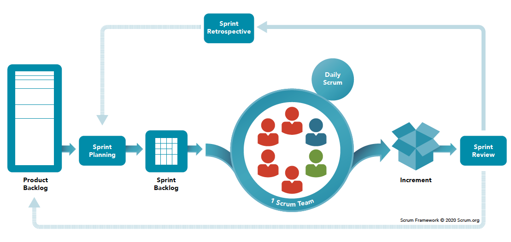

# SCRUM

## Fundamentos

Scrum es un marco de trabajo ágil para la gestión y desarrollo de proyectos de software que se enfoca en la colaboración, la flexibilidad y la entrega iterativa e incremental de un producto. A continuación, se resumen los fundamentos de Scrum:

**Roles**: Scrum define tres roles principales: ***el propietario del producto (Product Owner), el equipo de desarrollo (Development Team) y el Scrum Master***. Cada uno de estos roles tiene responsabilidades específicas dentro del marco de trabajo.

**Artefactos**: Scrum define tres artefactos principales: el ***Product Backlog, el Sprint Backlog y el Incremento***. El Product Backlog es una lista ordenada de las características y funcionalidades del producto, el Sprint Backlog es la lista de tareas para el sprint actual y el Incremento es la versión del producto entregada al final de cada sprint.

**Eventos**: Scrum define una serie de eventos que tienen lugar durante el proceso de desarrollo. Estos eventos incluyen la ***reunión de planificación del sprint, el sprint en sí mismo, la reunión diaria de Scrum, la revisión del sprint y la retrospectiva del sprint***. Cada uno de estos eventos tiene una finalidad específica dentro del marco de trabajo.

**Principios**: Scrum se basa en una serie de principios, como la transparencia, la inspección y la adaptación. Estos principios se aplican a todos los aspectos del marco de trabajo, desde la planificación hasta la entrega del producto final.

**Ventajas**: Scrum tiene varias ventajas, incluyendo la capacidad de adaptarse rápidamente a los cambios, la mejora de la comunicación y la colaboración entre los miembros del equipo y la entrega iterativa e incremental de un producto de alta calidad.

En resumen, Scrum es un marco de trabajo ágil que se centra en la colaboración, la flexibilidad y la entrega iterativa e incremental de un producto de software. Scrum define roles, artefactos y eventos específicos, así como principios fundamentales que guían el proceso de desarrollo. Scrum ofrece numerosas ventajas, incluyendo la capacidad de adaptarse a los cambios y la mejora de la calidad del producto final.

## Roles SCRUM 

Scrum define tres roles principales que trabajan juntos para entregar un producto de software: el propietario del producto (Product Owner), el equipo de desarrollo (Development Team) y el Scrum Master. Cada uno de estos roles tiene responsabilidades específicas dentro del marco de trabajo.

**Propietario del producto (Product Owner)**: El propietario del producto es responsable de definir y priorizar el backlog del producto (Product Backlog) y asegurarse de que el equipo de desarrollo entienda los objetivos y requisitos del producto. Algunas de las responsabilidades específicas del propietario del producto incluyen: 

- Definir y mantener el backlog del producto, que es una lista priorizada de las características y funcionalidades del producto.
- Comunicar la visión del producto y los requisitos a todos los miembros del equipo de desarrollo y otras partes interesadas.
- Asegurarse de que el equipo de desarrollo tenga el contexto necesario para tomar decisiones informadas sobre la implementación del producto.
- Aceptar o rechazar el trabajo completado por el equipo de desarrollo.

**Equipo de desarrollo (Development Team)**: El equipo de desarrollo es responsable de diseñar, construir, probar y entregar el producto. El equipo de desarrollo es autónomo y se organiza de manera autónoma para realizar el trabajo. Algunas de las responsabilidades específicas del equipo de desarrollo incluyen:

- Trabajar juntos para entregar incrementos del producto funcionales en cada sprint.
- Participar en la reunión de planificación del sprint para establecer los objetivos del sprint y seleccionar el trabajo del Sprint Backlog.
- Colaborar con el propietario del producto para comprender los requisitos del producto y asegurarse de que el trabajo esté alineado con la visión del producto.
- Participar en la reunión diaria de Scrum para sincronizar el trabajo y resolver impedimentos.
- Realizar pruebas y asegurarse de que el producto cumpla con los estándares de calidad.

**Scrum Master**: El Scrum Master es responsable de guiar y facilitar el proceso de Scrum y asegurarse de que se sigan los principios y prácticas del marco de trabajo. Algunas de las responsabilidades específicas del Scrum Master incluyen:

- Facilitar los eventos de Scrum y asegurarse de que se sigan las prácticas del marco de trabajo.
- Ayudar al equipo de desarrollo a resolver impedimentos y problemas.
- Asegurarse de que el equipo de desarrollo tenga las herramientas y la capacitación necesarias para realizar el trabajo de manera efectiva.
- Facilitar la colaboración y la comunicación entre el equipo de desarrollo y el propietario del producto.
- Ayudar al equipo de desarrollo a mejorar continuamente el proceso y la entrega del producto.

En resumen, cada uno de los roles de Scrum tiene responsabilidades específicas para garantizar que el proceso de desarrollo de software sea efectivo y eficiente. El propietario del producto se enfoca en la definición y priorización del backlog del producto, el equipo de desarrollo se enfoca en la entrega del producto y el Scrum Master se enfoca en facilitar y guiar el proceso de Scrum en general. Todos los miembros del equipo de Scrum trabajan juntos para entregar un producto de alta calidad en cada iteración del proceso.

## Eventos 

1. Sprint Planning: Esta es una reunión que se lleva a cabo al comienzo de cada Sprint, en la que el equipo se reúne para planificar el trabajo a realizar durante el Sprint. Durante la Sprint Planning, el equipo discute los elementos del producto que se incluirán en el Sprint y cómo se llevará a cabo el trabajo.

1. Daily Standup: También conocida como Daily Scrum, esta es una reunión diaria corta que se lleva a cabo durante el Sprint. Durante la Daily Standup, el equipo se reúne para revisar el progreso del proyecto, identificar obstáculos y planificar el trabajo.

1. Sprint Review: Esta es una reunión que se lleva a cabo al final de cada Sprint, en la que el equipo de desarrollo muestra el trabajo completado durante el Sprint a los interesados y partes involucradas en el proyecto. Durante la Sprint Review, el equipo presenta los elementos del producto terminados o incompletos y recibe retroalimentación sobre su trabajo.

1. Sprint Retrospective: Esta es una reunión que se lleva a cabo al final de cada Sprint, en la que el equipo reflexiona sobre su proceso de trabajo durante el Sprint. Durante la Sprint Retrospective, el equipo discute lo que salió bien, lo que podría mejorar y qué cambios se deben hacer para el próximo Sprint.

En general, estos eventos son esenciales para el marco de trabajo de SCRUM, ya que ayudan a mantener al equipo alineado y enfocado en los objetivos del proyecto. Cada evento tiene su propio propósito y enfoque, y juntos forman un proceso iterativo para desarrollar productos de manera efectiva y eficiente.

## Artefactos 

Los artefactos de SCRUM son elementos que se crean y utilizan en el contexto de un proyecto de SCRUM y son esenciales para garantizar la transparencia y la visibilidad del trabajo que se está realizando. Los tres artefactos de SCRUM son:

1. Product Backlog: Es una lista ordenada de elementos del producto que el equipo de SCRUM va a trabajar en el futuro. Cada elemento del Product Backlog se escribe en una tarjeta o en una herramienta de seguimiento de proyecto y se detalla lo suficiente para que el equipo pueda estimar su tamaño y su complejidad. El Product Owner es responsable de mantener el Product Backlog y de asegurarse de que los elementos más importantes y valiosos se encuentren en la parte superior de la lista.

1. Sprint Backlog: Es una lista de elementos del Product Backlog que el equipo ha seleccionado para trabajar durante el Sprint actual. Los elementos del Sprint Backlog se detallan aún más y se dividen en tareas que se asignan a los miembros del equipo durante la Sprint Planning. El Sprint Backlog es propiedad del equipo de desarrollo y se actualiza diariamente durante la Daily Scrum.

1. Incremento: Es la suma de todos los elementos del producto completados durante el Sprint actual y todos los Sprint anteriores. Cada Incremento debe ser utilizable y estar en un estado terminado, lo que significa que no debe haber elementos incompletos o errores importantes. El objetivo de cada Sprint es producir un Incremento nuevo y listo para ser lanzado al mercado o para ser utilizado por los usuarios.

En resumen, los artefactos de SCRUM son elementos esenciales que ayudan a los equipos de SCRUM a mantener la transparencia y visibilidad del trabajo que se está realizando. El Product Backlog, el Sprint Backlog y el Incremento son creados y utilizados a lo largo de todo el proyecto y se actualizan constantemente para garantizar que el equipo esté trabajando en los elementos más importantes y valiosos del producto.