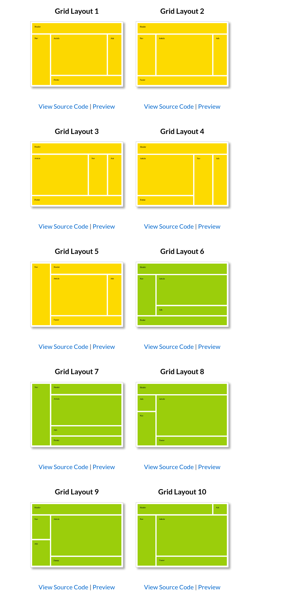

# Actividad 6.1 - Layouts con CSS Grid 

## Objetivo 
Aplicar CSS Grid para solucionar distintos requerimientos de layouts.

## Pasos a seguir
1. Utilizando el archivo HTML base entregado genere 10 archivos para cada uno de los Layouts solicitados, con el siguiente patron de nombre: **layout-XX-g.html**, donde XX es el número.
2. Genere el CSS necesario para lograr cada uno de los Layouts, puede generar el código CSS dentro de una etiqueta STYLE en el mismo documento o en un archivo externo. 
3. Es importante NO modificar el código HTML 
4. Guarde los archivos dentro de su Repositorio Github para ejercicios en una carpeta llamada **Ejercicio-6.1** 
5. Asegúrese de que sean visibles a través de Github Pages 
6. Genere un archivo llamado **indice.html** donde estén los vínculos hacia cada uno de los 10 Layouts. 
7. Comparta el enlace de Github Pages para visualizar el índice 

