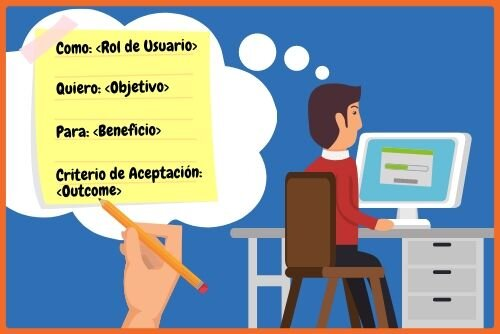
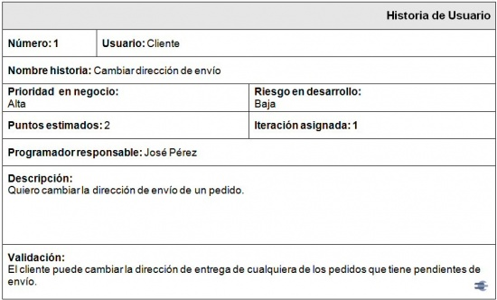

# Historias de Usuarios 

En SCRUM, los requerimientos se escriben en forma de historias de usuario. Una historia de usuario es una descripción simple y concisa de una funcionalidad o característica que el usuario final desea o necesita en el producto. Es importante que estas historias de usuario sean claras y fáciles de entender, para que todo el equipo pueda trabajar en conjunto para satisfacer las necesidades del usuario.

Para escribir una buena historia de usuario, se recomienda seguir el siguiente formato:

Enunciar quién es el usuario: Se debe describir el perfil del usuario para el cual se está diseñando la funcionalidad. Por ejemplo: "Como cliente de una tienda en línea..."

Describir la necesidad o el objetivo del usuario: Se debe especificar cuál es la necesidad o el objetivo que el usuario quiere lograr. Por ejemplo: "quiero poder filtrar los productos por categoría para encontrar lo que estoy buscando más fácilmente".

Establecer el resultado deseado: Se debe describir cuál es el resultado deseado que el usuario espera de la funcionalidad. Por ejemplo: "quiero ver una lista de productos que se ajusten a mis criterios de búsqueda".

Agregar detalles adicionales: Si es necesario, se pueden agregar detalles adicionales para clarificar la historia de usuario. Por ejemplo, "me gustaría que el filtro de búsqueda incluya opciones de clasificación por precio y marca".

Es importante tener en cuenta que cada historia de usuario debe ser lo suficientemente pequeña para ser completada en una o dos iteraciones (sprints). Además, las historias de usuario deben ser escritas en colaboración con el equipo de desarrollo y el propietario del producto para garantizar que sean realistas y factibles.

# Ejemplos de historias de usuario 

1. Como cliente del banco, quiero poder acceder a una pantalla de inicio clara y atractiva para tener una experiencia agradable al ingresar al sitio web.

1. Como persona con discapacidad visual, quiero poder acceder a todos los servicios bancarios en línea utilizando un lector de pantalla, para poder administrar mis finanzas de manera independiente y cómoda.

1. Como cliente del banco, quiero poder conocer la historia, los servicios y los valores del banco a través de una página "Sobre Nosotros" para tener confianza en la institución financiera.

1. Como cliente del banco, quiero poder simular una inversión con diferentes tasas de interés y plazos para conocer mi ganancia potencial y tomar decisiones informadas de inversión.

1. Como cliente del banco, quiero poder acceder a una sección de noticias y actualizaciones para estar informado de las últimas novedades sobre el banco y el mercado financiero.

1. Como cliente del banco, quiero poder enviar mensajes al banco a través de un formulario de contacto para obtener respuestas rápidas y efectivas a mis preguntas e inquietudes.

1. Como cliente del banco, quiero poder acceder a una sección de "Preguntas Frecuentes" para resolver mis dudas de manera rápida y sencilla.

1. Como cliente del banco, quiero poder transferir dinero entre mis cuentas de manera segura y fácil para realizar mis transacciones bancarias de manera efectiva.

1. Como usuario, quiero poder acceder a una página de "Trabaja con nosotros" para conocer las oportunidades de trabajo en el banco y enviar mi currículum.

## Lectura 

https://www.atlassian.com/es/agile/project-management/user-stories